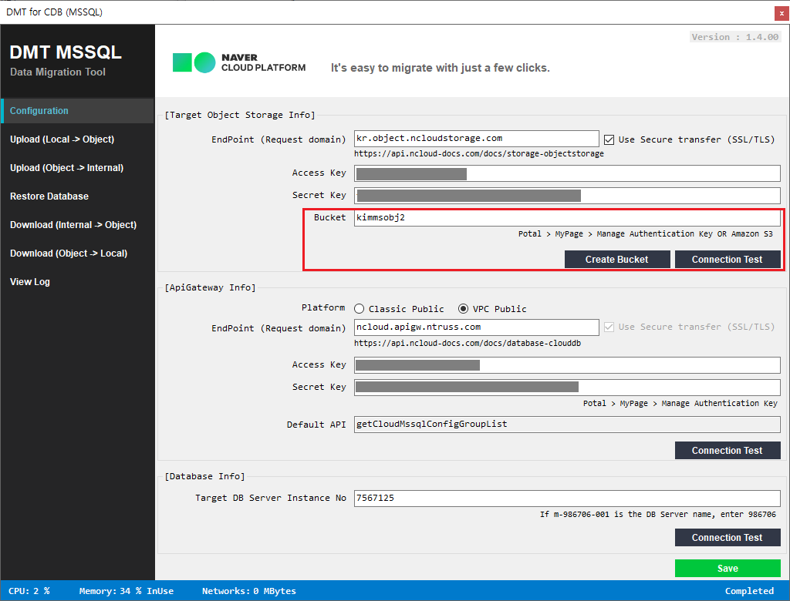
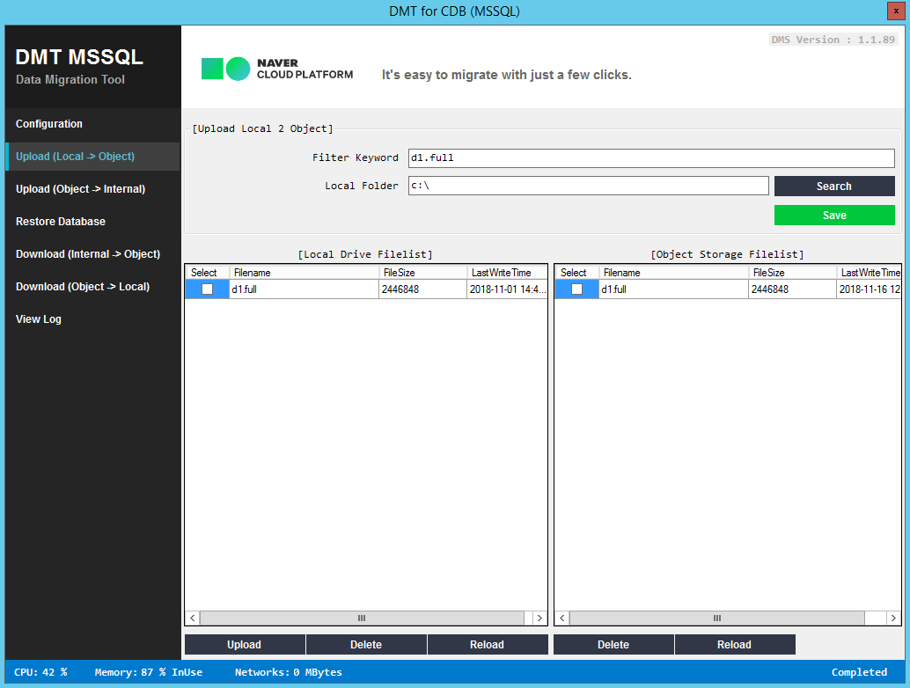
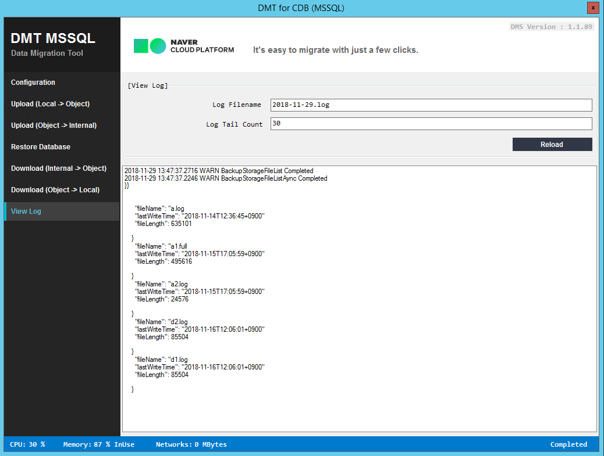

## DMT 서비스 소개

DMT (Data Migration Tool)는 네이버 클라우드 데이터베이스 서버에 전체 백업과 로그 백업을이용해 서비스를 클라우드로 마이그레이션 하거나, 사용 중인 클라우드 데이터베이스 백업을 내려받는 프로그램입니다. 현재 Cloud DB for MSSQL만 지원하고 있으며, 향후 다른 데이터베이스도 지원할 계획입니다.

**21년 9월 17일 VPC Public 망에 DMT 기능이 추가 되었습니다.** 

### 동작 방식 및 포함된 예제

Cloud DB에 백업 파일을 이용해 복원하기 위해서는 몇 번의 파일 복사가 필요합니다. 첫 번째, 사용자 백업 파일을 Amazon S3 오브젝트 스토리지(Object Storage)나, 네이버 클라우드 플랫폼 오브젝트 스토리지로 업로드합니다. 이때 S3 Browser 나 제공된 프로그램으로 업로드 가능합니다. 두 번째, 백업 복구용 내부 NAS 스토리지(Internal Storage)에 업로드합니다. 세 번째, 지정한 RDS 서버에 복구해 마이그레이션을 완료합니다.(Amazon S3에 백업된 데이터베이스 파일은 오브젝트 스토리지로 옮길 필요 없이 바로 내부 스토리지로 옮길 수 있습니다. ) 내부 스토리지로 올려진 파일은 15일 이내 복구하지 않으면, 모두 삭제됩니다.

API Gateway를 이용해 오브젝트 스토리지에서 내부 스토리지로 복사, 내부 스토리지에서 데이터베이스를 복구, 백업된 내부 스토리지 파일을 조회하거나 오브젝트 스토리지로 다운로드하는 API를 제공하고 있습니다. C# 응용프로그램 DMT는 사용자가 직접 API를 작성하지 않고, 필수 정보만 입력하고 API를 호출해 마이그레이션을 할 수 있으며, 다음 예제를 포함하고 있습니다.

- Hmac 인증 예제 
- Object Storage API 호출 예제
  - Bucket 조회
  - 파일 업로드, 다운로드
  - 파일 삭제
  - 파일 리스트 
- API 호출 예제
  - Configuration Group 조회 
  - 내부 스토리지 파일 업로드, 다운로드
  - 리스토어 데이터베이스
  - 리스토어 로그
  - 결과 조회
- 기타
  - 사용자 컴포넌트 
  - TAP (Task Asynchronous Pattern)
  - 이벤트 드리븐
  - Json 사용법
  - 성능 카운터를 이용한 로컬 리소스 사용량 모니터링
  - 파일 핸들링

Git Repository에서 DmtMssql.zip 파일을 다운로드해 바로 마이그레이션에 사용할 수 있으며, 필요할 경우 전제 소스 파일을 다운로드해 수정 편집이 가능합니다.

### 설정 (Configuration)

로컬 컴퓨터에서 접속할 오브젝트 스토리지 정보(Target Object Storage Info)와 API를 이용하기 위한 기본 정보 ( API Gateway Info), 미리 생성해둔 RDS 데이터베이스 정보(Database Info)가 필요합니다. 본 단계가 정상적으로 테스트 되고 저장되면 로컬 백업파일을 이용해 RDS에 데이터베이스를 복구할 수 있습니다. 아래 가이드를 숙지해 해당 정보를 저장하고 다음 작업을 진행하면 됩니다. (업로드 할 파일이름은 한글과 공백을 지원하지 않습니다.) 

ApiGateway Info 항목의 Platform 은 Classic Public 과 VPC Public 을 지원하고 있습니다. 사용 할 서버가 있는 Platform 정보를 저장 합니다.  

#### 콘솔에서 Classic 과 VPC Platform 선택

#### Target Object Storage Info

##### EndPoint 

[링크 : ObjectStorageEndPoint_URL](https://api.ncloud-docs.com/docs/storage-objectstorage) Amazon S3 EndPoint 나 네이버 클라우드 플랫폼 오브젝트 스토리지 접속 도메인입니다. http:// 및 https://는 제외하고 적습니다. 해당 URL 이 틀리면 A WebException with status NameResolutionFailure was thrown. 에러가 발생합니다.

##### Access Key

Potal > MyPage > Manage Authentication Key 페이지에서 키를 생성합니다. 해당 정보가 틀리거나 사용중지 상태이면 Access Denied 가 발생합니다.

##### Secret Key

위 페이지에서 Secret Key Show를 눌러 Secret Key를 확보합니다. 해당 정보가 틀릴 경우 signature 오류가 발생합니다.

##### Bucket

오브젝트 스토리지에 버킷을 만들어줍니다. 

#### API Gateway Info

##### EndPoint

[링크 : Cloud_API_개요](https://api.ncloud-docs.com/docs/database-clouddb) 사용자 가이드에는 URL 및 본 C# 프로그램에서 사용하는 API의 자세한 설명이 있습니다. 

##### Access Key

위 설명과 같음

##### Secret Key

위 설명과 같음 

#### Database Info

데이터베이스를 생성 후, DB server name 이 m-1010059-001이라면 1010059만 입력합니다. 해당 정보가 틀릴 경우 Server does not exists 오류가 발생합니다.

위 정보를 입력 후 각 Connection Test 버튼을 눌어 올바르게 세팅되었는지 확인합니다.

#### 정보저장 (Save)

Save를 눌러 저장합니다. 저장 버튼은 setObjectStorageInfo API를 호출해 DMS API 가 사용할 오브젝트 스토리지 정보를 저장합니다. **저장하지 않으면 DMS API 가 동작하지 않습니다.**

## 데이터베이스 복구

### 오브젝트 스토리지 업로드(Upload Local -> Object)

로컬에 있는 백업 파일을 오브젝트 스토리지로 업로드합니다. 모든 파일은 bucket의 root에 올려지며, 여러 파일을 동시에 선택해 업로드 가능합니다. 올리는 도중 프로그램의 하단 상태 바에컴퓨터 리소스 사용률을 볼 수 있습니다.

#### Upload Local 2 Object

##### Filter Keyword

키워드를 입력하면 정규 표현식을 이용해 필터 한 결과를 보여줍니다.

##### Local Folder

Search 버튼을 눌러 로컬 폴더를 변경합니다. 

##### Local Drive FileList

리스트 박스 파일을 선택하고 하단의 Upload, Delete, Reload 버튼을 눌러 동작을 실행할 수 있습니다. 

##### Object Storage Filelist

리스트 박스 파일을 선택하고 하단의 Delete, Reload 버튼을 눌러 동작을 실행할 수 있습니다. 업로드 중인 파일은 다시 Reload 해야 확인할 수 있습니다. 

### 백업 리스토어 전용 내부 스토리지로 업로드 (Upload Object -> Internal)

오브젝트 스토리지에 업로드가 완료된 파일을 백업 리스토어 전용 내부 스토리지 공간으로 옮깁니다. Internal Storage에 올려진 파일만 복구할 수 있습니다. 

### 리스토어 데이터베이스 (Restore Database)

백업 리스토어 전용 스토리지에 올라온 데이터베이스 백업 파일을 이용해 복원합니다. 아래 하단의 with Recovery 체크박스는 추가 로그 백업이 있을 경우 체크하지 않습니다. 더 이상 추가로 복원할 데이터베이스 백업 파일이 없다면, with Recovery 체크박스에 체크 후 Restore Database 나 Restore Log를 눌러 복원합니다. 

복원 중 RequestNo는 프로그램 내부 메모리에 저장되어 있고, 해당 번호를 이용해 복구 상태를 그리드의 오른쪽에 표시해 줍니다. Reload를 주기적으로 눌러 복원 상태를 확인할 수 있습니다. 한 번에 하나의 파일만 복원할 수 있습니다. 

##### Filter Keyword

키워드를 입력하면 정규 표현식을 이용해 필터 한 결과를 보여줍니다. 

##### Stop At Time 

로그 백업을 이용해 해당 지정한 시간까지만 리커버리 하길 윈할 경우, 미리 입력된 포맷에 맞게 년, 월, 일, 시간을 입력합니다. 전체 백업만을 이용해 복원하거나, 로그 백업의 마지막까지 복원하길 원하는 경우 입력 필드를 수정하지 않으면 됩니다. 

##### New Database Name

백업 파일을 이용해 데이터베이스를 복구할 때 지정한 이름으로 데이터베이스가 생성됩니다. 

##### Change Internal Storage Folder

Object Storage bucket 하위 폴더를 생성해 파일을 S3 브라우저로 올린 경우나, 네이버 클라우드 플랫폼 CDB MSSQL 백업을 내려받은 경우 해당 폴더 이름을 적습니다. Internal Storage는 Object Storage의 폴더 구조를 그대로 복사하며 수정할 수 없습니다. 

### 로그보기 (View Log)

view log는 서버와의 상세 응답을 확인할 수 있습니다. desc 정렬로 보이며, Log Tail Count 값을 늘여 더 많은 로그를 확인할 수 있습니다. 

## 데이터베이스 백업 다운로드

### 복구 전용 내부 스토리지 에서 오브젝트스토리지 다운로드 (Download Internal -> Object)

내부 스토리지는 업로드용과 다운로드 용이 다른 곳을 바라보고 있으며, 설정에서 정한 인스턴스의 모든 백업을 선택해 다운로드할 수 있습니다. 

##### Filter Keyword

키워드를 입력하면 정규 표현식을 이용해 필터 한 결과를 보여줍니다.  전체 백업은 full이라는 키워드로 필터 가능하며, 트랜잭션 로그 백업은 log라는 키워드로 필터 가능합니다. 

### 오브젝트스토리지 에서 로컬로 다운로드 (Download Object -> Local)

오브젝트 스토리지 파일은 S3 브라우저나 본 프로그램으로 Local 컴퓨터로 다운로드할 수 있습니다. 오브젝트 스토리지의 폴더 구조와 동일하게 로컬에 다운로드합니다. 

### Packages

* AutoVersionUpdater
  * https://github.com/bezzad/AutoVersionUpdater
  * https://github.com/bezzad/AutoVersionUpdater/blob/master/LICENSE
* AWSSDK.S3, AWSSDK.Core
  - https://github.com/aws/aws-sdk-net/
  - http://aws.amazon.com/apache2.0/
* Clarius.TransformOnBuild-unofficial
  * https://github.com/mnaoumov/TransformOnBuild
  * https://github.com/mnaoumov/TransformOnBuild/blob/master/LICENSE
* Newtonsoft.Json
  * https://www.newtonsoft.com/json
  * https://raw.github.com/JamesNK/Newtonsoft.Json/master/LICENSE.md
* NLog
  - http://nlog-project.org/
  - https://github.com/NLog/NLog/blob/master/LICENSE.txt
* NLog.Config
  - http://nlog-project.org/
  - http://raw.github.com/NLog/NLog/master/LICENSE.txt
* NLog.Schema
  - http://nlog-project.org/
  - http://raw.github.com/NLog/NLog/master/LICENSE.txt

감사합니다. 

